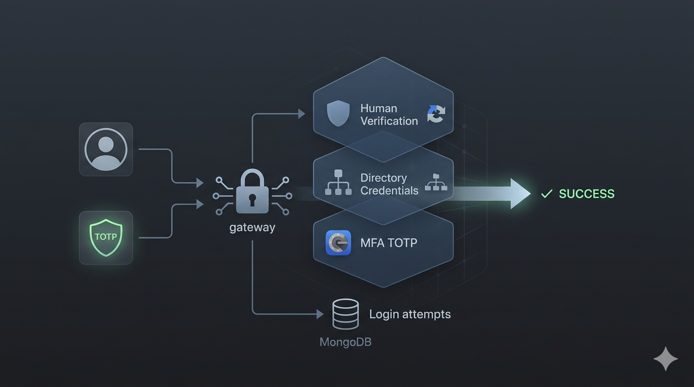

<div align="center">
  

  <h1>🛡️ SecureGate-LDAP</h1>
  <p><strong>Enterprise-Grade MFA Gateway for Active Directory & LDAP</strong></p>

  <p>
    
    
    
    
  </p>
</div>

---

## 📖 Overview
**SecureGate-LDAP** is a hardened authentication proxy designed for the **Pearson BTEC IT System** curriculum. It introduces a **Zero-Trust** architecture to legacy infrastructure by requiring three independent factors: **Directory Credentials**, **reCAPTCHA Verification**, and **TOTP Tokens**.

---


## 🛠️ System Architecture

### 🛡️ The Triple-Lock Security Flow
1. **Identity Lock:** Validates credentials against **Active Directory** or **LDAP3**.
2. **Integrity Lock:** Uses **Google reCAPTCHA v2** to neutralize automated bot attacks.
3. **Ownership Lock:** Verifies a 6-digit **TOTP** token (Google Authenticator) generated from a unique Base32 secret stored in **MongoDB**.

---

## ✨ Features
* **Rate Limiting:** Automated account lockout after 5 failed attempts.
* **Cryptographic Safety:** Passwords hashed with `Bcrypt` (Salted).
* **Hardened Headers:** Protection against XSS, Clickjacking, and MiTM (HSTS).
* **Minimalist UI:** A clean, macOS-inspired interface designed for professional SaaS environments.

---

## 🚀 Installation & Setup

### ⌨️ Commands
```bash
# 1. Clone the repository
git clone [https://github.com/Yazan-Ayasrah/SecureGate-LDAP.git](https://github.com/Yazan-Ayasrah/SecureGate-LDAP.git)
cd SecureGate-LDAP

# 2. Install dependencies
pip install -r requirements.txt

# 3. Configure .env (See below)

# 4. Run the application
python app.py
```